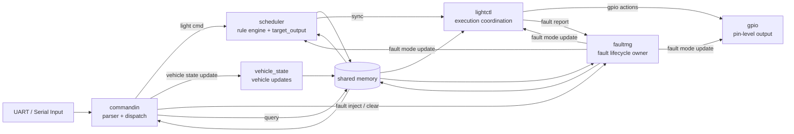

# LightDemo

```text
      _________________________________
   .-'   __     Cartoon Headlight     '-.
  /    _/  \_      .-""""-.      _/  \_  \
 |    /  ()  \    /  .--.  \    /  ()  \  |
 |    \      /===|  (____)  |===\      /  |
 |      '-..-'    \  '--'  /    '-..-'    |
  \                  '-..-'                /
   '-.___  seL4 Microkit Light Demo  __.-'
```

一个基于 seL4 + Microkit 的汽车车灯控制演示工程。

它不是单纯的“按键开灯”小实验，而是把一条更像工程项目的链路放在同一个仓库里：

- UART 输入
- 规则调度
- 执行控制
- GPIO 输出
- fault management
- host-side test
- QEMU 端到端验证

如果你刚接触 seL4 / Microkit，这个仓库适合你拿来理解“多保护域协作的最小嵌入式系统”长什么样。

如果你已经写过一些嵌入式代码，这个仓库适合你拿来演进“tutorial demo -> engineering-grade project”的过程。

## 项目亮点

- 用 `qemu_virt_aarch64` 跑完整的 Microkit 系统，不依赖真实板卡也能走通主链路。
- 把 `commandin`、`scheduler`、`lightctl`、`gpio`、`faultmg` 拆成独立保护域，结构清晰。
- 故障管理不是只会升级的计数器，当前已具备 lifecycle v1：`clear`、观察窗口、逐级回退、anti-flap。
- 同时保留 host-side 单元测试和最小串口 E2E，便于新手理解，也便于后续做持续演进。

## 这是什么

当前主线实现的是一条完整车灯控制数据流：

```text
commandin -> scheduler -> lightctl -> gpio
lightctl  -> faultmg
faultmg   -> lightctl
faultmg   -> gpio
faultmg   -> scheduler
commandin -> faultmg   (fault inject / clear)
commandin -> vehicle_state
```

你可以把它理解成一个“缩小版汽车电子控制系统”：

- `commandin` 像输入网关
- `scheduler` 像规则裁决层
- `lightctl` 像执行协调层
- `gpio` 像硬件驱动层
- `faultmg` 像故障 owner

## 适合谁

- 想学 seL4 / Microkit，但不想一上来就读抽象 demo 的初学者
- 想看一个 C 语言嵌入式项目如何逐步补测试、补结构、补 fault lifecycle 的开发者
- 想找一个可以继续做 PR、扩功能、加文档、补验证的开源练手机会的人

## 快速上手

### 1. 环境要求

- Microkit SDK `2.0.1`
- AArch64 交叉编译器
  `Makefile` 会自动探测：
  `aarch64-linux-gnu-gcc`
  `aarch64-unknown-linux-gnu-gcc`
  `aarch64-none-elf-gcc`
- `qemu-system-aarch64`

默认 SDK 路径是：

```text
../microkit-sdk-2.0.1
```

如果你的 SDK 不在这个位置：

```bash
make build MICROKIT_SDK=/path/to/microkit-sdk-2.0.1
```

### 2. 一条命令构建

```bash
make build
```

### 3. 运行

```bash
make run
```

### 4. 最小验证

```bash
make smoke
```

如果你只想先确认 host-side 逻辑没坏：

```bash
make test-policy
make test-runtime
make test-fault
make test-transport
make test-snapshot
```

## 你能看到什么

这个仓库重点不在“UI 好看”，而在“控制链路完整、边界清晰、可验证”。

你可以从这里看到：

- Microkit 保护域之间怎样通信
- 为什么 `faultmg` 必须是 fault mode 的唯一 owner
- 为什么只靠 counter 不够，需要 lifecycle state
- 如何用 QEMU + shell script 做最小 E2E
- 如何把 tutorial 风格代码逐步整理成可维护项目

## 操作指南

这一部分保留为日常使用入口。

### 推荐目标

- `make build`
- `make run`
- `make clean`
- `make debug`
- `make release`
- `make smoke`
- `make test-policy`
- `make test-runtime`
- `make test-fault`
- `make test-fault-transport`
- `make test-transport`
- `make test-snapshot`
- `make test-integration-fault`
- `make test-serial-e2e`
- `make help`

### 默认构建设置

- `BOARD := qemu_virt_aarch64`
- `MICROKIT_CONFIG := debug`
- 输出镜像：`build/loader.img`
- 报告文件：`build/report.txt`

### Legacy 兼容目标

仓库仍保留教程阶段目标：

- `make part1`
- `make part2`
- `make part3`
- `make part4`
- `make part5`
- `make legacy`

说明：

- 当前 `light.system` 已经描述完整系统，所以 `part1` 到 `part4` 只是兼容入口。
- 当前主线完整构建等价于 `make part5`。

## 串口输入说明

### 灯光控制

| 功能 | 打开 | 关闭 | 控制码 |
| --- | --- | --- | --- |
| 近光灯 | `L` | `l` | `0x01` / `0x00` |
| 远光灯 | `H` | `h` | `0x11` / `0x10` |
| 左转向灯 | `Z` | `z` | `0x21` / `0x20` |
| 右转向灯 | `Y` | `y` | `0x31` / `0x30` |
| 示廓灯 | `P` | `p` | `0x41` / `0x40` |
| 制动灯 | `B` | `b` | `0x51` / `0x50` |

### fault lifecycle 调试

| 功能 | 输入 |
| --- | --- |
| 注入 `LIGHT_ERR_MODE_CONFLICT` | `!` |
| 注入 `LIGHT_ERR_HW_STATE_ERR` | `#` |
| clear 当前 active faults / 推进恢复观察 tick | `C` |
| 输出统一状态快照 | `?` |

`STATUS_SNAPSHOT` 会输出：

- 当前 `fault mode`
- 当前 `lifecycle`
- 恢复窗口进度 `recovery_ticks`
- 当前 active fault 位图
- 当前 target output 和 fault 统计

## 目录结构

```text
lightdemo/
├── build/              # 构建输出目录
├── include/            # 公共头文件
├── commandin.c         # UART 输入、parser、dispatch
├── scheduler.c         # 规则裁决，生成 target_output
├── lightctl.c          # 执行协调层
├── gpio.c              # GPIO / 定时器侧硬件操作
├── faultmg.c           # fault lifecycle owner
├── vehicle_state.c     # 车辆状态更新
├── light.system        # Microkit 系统描述
├── scripts/            # smoke / integration / serial E2E 脚本
├── tests/              # host-side 测试
├── Makefile            # 构建入口
├── README.md
└── README.en.md
```

## 核心组件一眼看懂

### `commandin`

- 负责 UART 接收
- 负责字符解析
- 负责统一 transport message 派发
- 不拥有 fault lifecycle

### `scheduler`

- 消费输入命令和车辆状态
- 结合当前 `fault_mode` 计算 `target_output`
- 只消费 fault mode，不负责恢复逻辑

### `lightctl`

- 根据 `target_output` 生成实际动作
- 做运行时保护检查
- 在需要时向 `faultmg` 上报 fault

### `gpio`

- 负责最终硬件输出
- 同步观察当前 fault mode

### `faultmg`

- fault mode 的唯一 owner
- 管理 `ACTIVE / RECOVERING / STABLE`
- 支持 inject、clear、恢复窗口、逐级回退
- 负责把 mode 广播给其他域

## fault lifecycle v1

当前仓库已经不是“只会升级的 fault counter”。

目前的最小闭环行为是：

1. 注入或上报 fault 后，系统按当前规则升级到 `WARN / DEGRADED / SAFE_MODE`
2. `clear` 后不立刻恢复，而是进入 `RECOVERING`
3. 观察窗口满足后，每次只下降一级
4. 恢复过程中如果再次 fault，恢复进度清零并立即打断恢复

这套设计的目的不是一次做到复杂终局，而是先让仓库具备：

- 可解释
- 可测试
- 能闭环
- 能继续演进

## 验证方式

### Host-side 测试

```bash
make test-policy
make test-runtime
make test-fault
make test-fault-transport
make test-transport
make test-snapshot
```

### QEMU 验证

```bash
make smoke
make test-integration-fault
make test-serial-e2e
```

验证重点包括：

- 命令输入是否正确传播
- `faultmg` 是否正确升级和广播 fault mode
- clear 后是否进入恢复观察期
- 是否只能逐级回退，而不是瞬间回到 `NORMAL`
- query/snapshot 是否能观察 lifecycle 状态

## 从哪里开始读代码

如果你是第一次看这个仓库，建议按这个顺序读：

1. [light.system](/home/chen/microkit_tutorial/lightCtlTest/light.system)
2. [commandin.c](/home/chen/microkit_tutorial/lightCtlTest/commandin.c)
3. [scheduler.c](/home/chen/microkit_tutorial/lightCtlTest/scheduler.c)
4. [lightctl.c](/home/chen/microkit_tutorial/lightCtlTest/lightctl.c)
5. [faultmg.c](/home/chen/microkit_tutorial/lightCtlTest/faultmg.c)
6. [light_fault_mode.c](/home/chen/microkit_tutorial/lightCtlTest/light_fault_mode.c)
7. [tests/test_light_fault_mode.c](/home/chen/microkit_tutorial/lightCtlTest/tests/test_light_fault_mode.c)
8. [scripts/serial_e2e_test.sh](/home/chen/microkit_tutorial/lightCtlTest/scripts/serial_e2e_test.sh)

## 为什么值得点个 Star

如果你喜欢这类项目，一个 Star 对仓库很有帮助。这个仓库的价值在于它同时覆盖了几类内容：

- seL4 / Microkit 入门友好
- 嵌入式控制链路完整
- fault lifecycle 有真实工程味道
- 测试和脚本不是摆设，能实际跑
- 很适合继续做小而清晰的 PR

## 当前限制

- 当前 lifecycle v1 仍是最小实现，还没有接入真实时间基准。
- 还没有做更完整的 fault taxonomy。
- 主目标仍然是把 tutorial demo 继续整理成工程化项目，而不是一次性堆很多 feature。
- `vmm/` 目录仍未接入默认主线构建。

## 系统架构图


