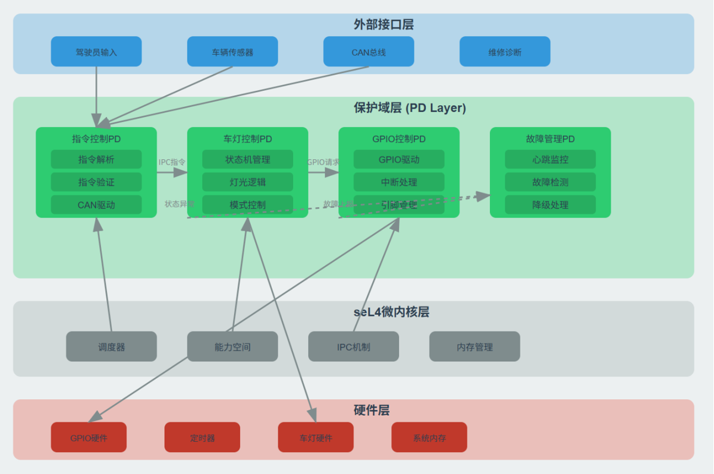

# LightDemo

基于 seL4 Microkit 的车灯控制演示工程。项目通过多个保护域协作，演示 UART 输入解析、规则调度、灯光控制、GPIO 驱动和故障记录之间的通信关系，默认目标板为 `qemu_virt_aarch64`，主要运行场景是 QEMU 下的功能验证。

## 项目简介

当前仓库实现的是一个分组件的车灯控制链路：

- `commandin` 从 UART 接收键盘输入，并把字符命令编码为统一的控制码。
- `scheduler` 根据共享状态更新允许执行的灯光集合，承担规则裁决职责。
- `lightctl` 根据调度结果触发具体灯光动作，并维护自身的状态一致性检查。
- `gpio` 直接访问 GPIO 和定时器映射，执行实际引脚电平控制。
- `faultmg` 接收错误上报，记录和聚合当前实现中的故障信息。

当前 `Makefile` 已整理为项目级构建入口，同时保留 `part1` 到 `part5` 作为 legacy 兼容目标，其中 `part5` 对应当前主线的完整组合。

## 仓库结构

```text
lightdemo/
├── build/              # 当前仓库内保留的构建输出目录
├── include/            # 公共头文件和轻量工具实现
├── vmm/                # 预留/实验性 VMM 相关代码，当前主线未接入默认构建
├── commandin.c         # UART 输入与命令编码
├── faultmg.c           # 错误接收与记录
├── gpio.c              # GPIO / 定时器侧硬件控制
├── light.system        # Microkit 系统描述
├── lightctl.c          # 灯光控制与状态协调
├── scheduler.c         # 规则调度与允许集更新
├── Makefile            # 构建入口
├── README.md
└── README.en.md
```

说明：

- `build/` 是构建输出目录，不是源码的一部分。
- `vmm/` 目录当前未纳入默认的 `part1` 到 `part5` 构建链路；相关规则在 `Makefile` 中也处于注释状态。

## 架构说明

### 组件职责

#### `commandin`

- 映射 UART 设备寄存器并处理中断。
- 接收键盘字符，如 `L`、`l`、`H`、`h`、`Z`、`z`、`Y`、`y`、`P`、`p`、`B`、`b`。
- 将字符转换为统一的单字节控制码，写入输入缓冲区后通知下游。

#### `scheduler`

- 从输入缓冲区读取控制码。
- 维护共享状态中的 `allow_flags` 等字段。
- 根据当前实现中的规则做准入判断，例如近光/远光、转向/制动之间的互锁关系。
- 当允许状态发生变化时，通知 `lightctl` 执行同步。

#### `lightctl`

- 读取 `scheduler` 更新后的共享状态。
- 将“允许执行的灯光状态”转换成具体 GPIO 操作通知。
- 跟踪本地最近一次灯光状态，避免重复下发。
- 在检测到速度限制、模式冲突或非法通知时，只通过消息寄存器向 `faultmg` 上报 fault event / 错误码。
- 缓存最近一次由 `faultmg` 下发的 fault mode，并只把该缓存作为运行时安全约束输入。

#### `gpio`

- 映射 GPIO MMIO 区域和定时器区域。
- 初始化灯光对应的输出引脚。
- 根据来自 `lightctl` 的通道号执行开灯/关灯操作。
- 接收 `faultmg` 广播的当前 fault mode，用于保持故障模式在域间的一致观察。
- 当前源码中包含定时器初始化和部分扩展性预留，但主线行为仍以各灯光引脚电平控制为主。

#### `faultmg`

- 接收 `lightctl` 发出的错误通知。
- 读取错误码并累计错误次数。
- 作为 fault mode 的唯一 owner，根据错误码和计数裁决 `NORMAL / WARN / DEGRADED / SAFE_MODE`。
- 通过现有通道把当前 fault mode 广播回 `lightctl` 和 `gpio`。
- 输出当前实现中的故障日志；当前仍未实现自动恢复到更低 fault mode 的流程。

### 系统拓扑

当前 `light.system` 对应的数据流如下：

```text
commandin -> scheduler -> lightctl -> gpio
lightctl  -> faultmg
faultmg   -> lightctl
```

补充说明：

- `scheduler` 与 `lightctl` 共享一块状态内存，用于传递允许标志和部分运行状态。
- `commandin` 使用 UART IRQ 作为输入入口。
- `lightctl` 与 `gpio` 之间不是单一通道，而是按灯光操作拆成多个通道，例如左右转向、制动灯、近光灯、远光灯、示廓灯的开关操作分别对应不同 channel ID。

## 环境要求

根据当前 `Makefile`，构建依赖以下环境：

- Microkit SDK 2.0.1
- AArch64 交叉编译工具链，`Makefile` 会按以下顺序自动探测：
  - `aarch64-linux-gnu-gcc`
  - `aarch64-unknown-linux-gnu-gcc`
  - `aarch64-none-elf-gcc`
- `qemu-system-aarch64`，用于 `make run`

默认 SDK 路径为：

```text
../microkit-sdk-2.0.1
```

如果 SDK 不在该位置，需要在执行 `make` 时显式传入 `MICROKIT_SDK`。

## 构建步骤

### 1. 准备 Microkit SDK

将 Microkit SDK 2.0.1 解压到仓库的同级目录，形成类似结构：

```text
<parent>/
├── lightdemo/
└── microkit-sdk-2.0.1/
```

如果目录关系不同，也可以在命令中指定：

```bash
make build MICROKIT_SDK=/path/to/microkit-sdk-2.0.1
```

### 2. 选择构建目标

推荐使用新的项目级入口：

- `make build`：构建当前完整镜像，默认等价于 legacy `part5`
- `make run`：沿用当前 `qemu_virt_aarch64` 的 QEMU 启动流程
- `make clean`：清理当前已知构建产物
- `make debug`：以 `MICROKIT_CONFIG=debug` 构建完整镜像
- `make release`：以 `MICROKIT_CONFIG=release` 构建完整镜像
- `make smoke`：执行最小自动化 smoke test
- `make test-integration-fault`：执行带测试 hook 的 QEMU fault injection 集成测试
- `make test-policy`：执行宿主机上的规则层单元测试
- `make test-runtime`：执行宿主机上的运行时安全单元测试
- `make test-fault`：执行宿主机上的故障模式单元测试
- `make help`：显示最终 target 列表和常用覆盖参数

推荐使用：

```bash
make build
```

构建时会使用：

- `BOARD := qemu_virt_aarch64`
- 默认 `MICROKIT_CONFIG := debug`
- 构建输出目录：`build/`
- 默认镜像：`build/loader.img`
- 报告文件：`build/report.txt`

### 3. Legacy 分阶段目标

教程阶段目标仍保留，但已标注为 legacy 兼容别名：

- `make part1`：执行完整构建，并导出 `build/demo_part_one.img`
- `make part2`：执行完整构建，并导出 `build/demo_part_two.img`
- `make part3`：执行完整构建，并导出 `build/demo_part_three.img`
- `make part4`：执行完整构建，并导出 `build/demo_part_four.img`
- `make part5`：等价于 `make build`
- `make legacy`：顺序构建全部 legacy 阶段镜像

说明：

- 当前仓库的 `light.system` 需要完整系统镜像，因此 `part1` 到 `part4` 作为兼容入口统一复用完整构建结果，再按旧命名导出镜像文件。
- 主线镜像生成流程保持不变，`make build` 和 `make run` 仍以 `build/loader.img` 为入口。

### 4. 构建产物

根据当前 `Makefile`，主要产物包括：

- 各保护域 ELF：`build/*.elf`
- 镜像输出：`build/loader.img`
- legacy 阶段镜像：`build/demo_part_one.img` 到 `build/demo_part_five.img`
- Microkit 报告：`build/report.txt`

## 运行步骤

完成构建后，可通过以下命令启动 QEMU：

```bash
make run
```

`run` 目标会继续加载 `build/loader.img`，并以 `qemu-system-aarch64` 的 `virt` 机器模型运行，CPU 设为 `cortex-a53`，串口输出通过 `mon:stdio` 暴露到当前终端。

## Smoke Test

仓库现在提供一个最小自动化 smoke test：

```bash
make smoke
```

该测试会：

- 构建当前完整镜像
- 启动 QEMU 并等待 5 个核心模块初始化日志
- 发送 `L`、`H`、`B`
- 基于固定摘要日志断言 `scheduler -> lightctl -> gpio` 的关键状态传播链路

## Fault Injection 集成测试

仓库现在还提供一条最小侵入的 fault injection 集成验证：

```bash
make test-integration-fault
```

该测试会在单独的 `build-test-hooks/` 构建目录中启用测试 hook，并在 QEMU 中验证：

- `fault event -> faultmg mode transition -> lightctl immediate sync -> gpio output switch`
- `NORMAL -> DEGRADED`
- `NORMAL -> SAFE_MODE`
- mode 更新后无需等待下一次常规 `SCHED_APPLY` 即可生效

## Debug / Release 说明

- `debug` 和 `release` 通过切换 `MICROKIT_CONFIG`，选择 Microkit SDK 中 `qemu_virt_aarch64/debug` 或 `qemu_virt_aarch64/release` 目录下的板级输入。
- 在当前仓库中，`release` 除了切换 Microkit SDK 配置外，也会使用 `-O2 -DNDEBUG -g0`，更接近发布构建。
- 本地 Microkit SDK 2.0.1 已包含 `debug` 和 `release` 两套目录，因此 `make release` 当前可用。

## 本地验证与 CI

推荐的本地验证顺序：

```bash
make test-policy
make test-runtime
make test-fault
make smoke
make test-integration-fault
```

仓库还包含 GitHub Actions CI 配置：

- 默认运行 `make test-policy`、`make test-fault`
- 当 CI 环境提供 `MICROKIT_SDK_URL` 时，额外尝试运行 `make smoke`

如果本地或 CI 缺少 Microkit SDK / QEMU，则宿主机单元测试仍可单独执行。

## 使用方式

启动后，可通过串口输入以下字符命令控制灯光：

| 功能 | 打开 | 关闭 | 控制码 |
| --- | --- | --- | --- |
| 近光灯 | `L` | `l` | `0x01` / `0x00` |
| 远光灯 | `H` | `h` | `0x11` / `0x10` |
| 左转向灯 | `Z` | `z` | `0x21` / `0x20` |
| 右转向灯 | `Y` | `y` | `0x31` / `0x30` |
| 示廓灯 | `P` | `p` | `0x41` / `0x40` |
| 制动灯 | `B` | `b` | `0x51` / `0x50` |

这些字符首先由 `commandin` 编码，再经 `scheduler` 和 `lightctl` 逐级处理，最终由 `gpio` 执行对应硬件操作。

## 状态机与故障模式

- 规则层 `light_policy` 负责把命令转换为允许标志和目标灯态。
- 对于光束目标态，当前实现中 `HIGH_BEAM_ON` 在规则层会覆盖低光目标态，因此 `H` 会向 `lightctl` 和 `gpio` 传递 `high_beam_on`。
- 运行时安全层 `light_runtime_guard` 负责基于速度、执行历史和当前 fault mode 拒绝高风险动作。
- fault mode 的所有权当前收敛在 `faultmg`：`faultmg` 负责根据错误码和计数推导 `NORMAL / WARN / DEGRADED / SAFE_MODE`，再通过已有通道把当前 mode 广播给其他域。
- `lightctl` 不再维护独立的 fault mode 状态机，只缓存 `faultmg` 下发的当前 mode，并据此在最终输出路径上裁剪目标灯态。
- `gpio` 当前不参与 fault mode 裁决，但会接收 `faultmg` 的广播，用于保持域间对当前模式的统一观察。

### Fault Mode 输出策略

- `NORMAL`：不裁剪目标输出，按规则层和运行时保护的结果执行。
- `WARN`：当前保持与 `NORMAL` 一致，不额外裁剪最终输出，只保留告警与计数。
- `DEGRADED`：禁止远光输出；强制近光和示廓灯开启；保留转向和制动灯。
- `SAFE_MODE`：禁止远光输出；强制近光和示廓灯开启；保留转向和制动灯。

| Fault Mode | 制动灯 | 转向灯 | 近光灯 | 远光灯 | 示廓灯 | 最低照明 |
| --- | --- | --- | --- | --- | --- | --- |
| `NORMAL` | 按请求透传 | 按请求透传 | 按请求透传 | 按请求透传 | 按请求透传 | 不强制 |
| `WARN` | 按请求透传 | 按请求透传 | 按请求透传 | 按请求透传 | 按请求透传 | 不强制 |
| `DEGRADED` | 按请求透传 | 按请求透传 | 强制开启 | 强制关闭 | 强制开启 | 强制保留近光与示廓灯 |
| `SAFE_MODE` | 按请求透传 | 按请求透传 | 强制开启 | 强制关闭 | 强制开启 | 强制保留近光与示廓灯 |

## 已知限制与说明

- 本仓库当前以源码与构建定义为准；现有注释中存在乱码和历史表述，README 已尽量按照实际实现重新归纳，但不对源码注释本身做修复。
- 当前环境下若缺少 `make`、交叉编译器、Microkit SDK 或 QEMU，则无法直接完成构建与运行。
- 当前 fault mode 只支持升级，不支持自动恢复到更低模式。
- `gpio.c` 中包含部分定时器/扩展预留代码，但这些内容并未改变主线构建说明。
- 仓库内已存在 `build/` 产物；本次文档清理不会删除或重建这些文件。

## 附图

仓库中保留了架构示意图，可结合系统描述文件一起阅读：


