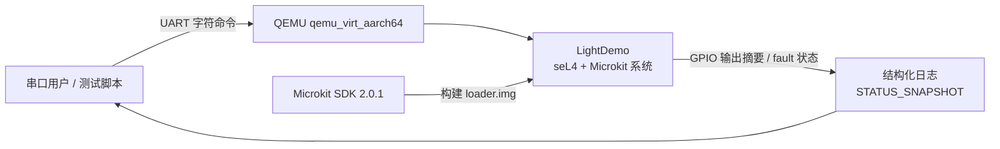

# 软件需求分析

**项目名称：** 基于 seL4 + Microkit 的汽车车灯控制演示系统  
**课程类型：** 工程实践  
**项目成员：** （请填写实际成员）  
**指导老师：** （请填写实际指导老师）  
**运行平台：** Ubuntu 22.04 + Microkit SDK 2.0.1 + QEMU `qemu_virt_aarch64`  
**文档版本：** v1.0  

## 版本修订记录

| 版本 | 日期 | 说明 | 作者 |
| --- | --- | --- | --- |
| v1.0 | 2026-05-15 | 初始版本，依据 LightDemo 当前工程状态整理需求。 | 项目组 |

## 目录

1. 引言  
2. 项目背景与目标  
3. 术语与定义  
4. 需求分析  
5. 功能需求  
6. 非功能需求  
7. 可行性分析  
8. 验收与测试需求  
9. 当前限制与后续演进  
10. 小结  

## 1. 引言

### 1.1 编写目的

本文档用于说明 LightDemo 项目的软件需求。LightDemo 是一个基于 seL4 Microkit 的汽车车灯控制工程实践项目，目标不是简单实现“串口输入后点亮某个灯”，而是围绕嵌入式系统工程中的模块隔离、消息传递、规则裁决、故障管理和自动化验证建立一个可解释、可测试、可演进的最小系统。

本文档面向项目开发人员、维护人员和课程检查人员，作为概要设计、详细设计、测试计划和用户手册的需求依据。

### 1.2 项目背景

汽车电子系统通常需要满足安全性、实时性、可诊断性和可维护性要求。车灯控制虽然功能直观，但其背后涉及输入采集、状态裁决、执行控制、硬件输出、故障检测、降级策略和恢复流程。传统单体式示例程序难以展示工程项目中的隔离边界和安全状态管理。

seL4 是一个强调高可信和强隔离的微内核，Microkit 提供了以 protection domain 为核心的系统构建方式。LightDemo 利用 Microkit 将车灯控制链路拆分为多个保护域，通过明确的 channel 和 shared memory 契约完成协作，从而展示嵌入式安全控制系统的工程化组织方式。

### 1.3 参考资料

- seL4 / Microkit SDK 2.0.1 文档
- 本项目 `README.md`
- 本项目 `docs/architecture.md`
- 本项目 `docs/safety_case.md`
- 本项目 `docs/requirements.md`
- 本项目 `docs/test_plan.md`
- 本项目源码与测试脚本

## 2. 项目背景与目标

### 2.1 项目目标

本项目的总体目标是实现一个可在 QEMU AArch64 环境中运行的汽车车灯控制演示系统。系统应具备以下工程特征：

- 使用 Microkit protection domain 拆分输入、调度、执行、GPIO 输出、车辆状态和故障管理职责。
- 使用 UART 模拟用户或外部控制输入。
- 使用共享内存保存 operator request、vehicle state、fault mode 和 target output。
- 使用集中化 channel 常量维护 Microkit 通信契约。
- 实现 fault lifecycle，包括 `ACTIVE`、`RECOVERING`、`STABLE`。
- 实现 fault mode，包括 `NORMAL`、`WARN`、`DEGRADED`、`SAFE_MODE`。
- 提供 host-side 单元测试和 QEMU 端到端验证。
- 形成可用于工程实践检查的需求、设计、测试和使用文档。

### 2.2 系统边界

本项目聚焦于嵌入式控制链路和安全降级逻辑，不直接接入真实车载硬件。GPIO 输出在 `qemu_virt_aarch64` 环境中通过日志和模拟 MMIO 行为观察。

系统边界如下：

- 输入边界：QEMU 串口输入。
- 输出边界：GPIO protection domain 的输出日志和状态摘要。
- 控制边界：scheduler 根据 operator request、vehicle state 和 fault mode 生成 target output。
- 安全边界：faultmg 是 fault lifecycle 和 fault mode 的唯一 owner。

## 3. 术语与定义

| 术语 | 定义 |
| --- | --- |
| seL4 | 高可信微内核，提供强隔离和形式化验证基础。 |
| Microkit | seL4 上的系统构建框架，用 protection domain、channel、memory region 描述系统。 |
| Protection Domain | Microkit 中的隔离执行单元，本项目中包括 `commandin`、`scheduler`、`lightctl` 等。 |
| Channel | Microkit 中 protection domain 间的通知通道。 |
| Shared Memory | 多个 protection domain 映射的共享内存区域，用于保存控制状态。 |
| Fault Mode | 故障模式，包括 `NORMAL`、`WARN`、`DEGRADED`、`SAFE_MODE`。 |
| Fault Lifecycle | 故障生命周期，包括 `STABLE`、`ACTIVE`、`RECOVERING`。 |
| Target Output | scheduler 计算出的目标车灯输出状态。 |
| Runtime Guard | lightctl 执行动作前的运行时保护检查。 |

## 4. 需求分析

### 4.1 用户角色

| 用户角色 | 使用目标 |
| --- | --- |
| 开发者 | 阅读源码、扩展控制逻辑、维护测试和文档。 |
| 测试者 | 在 Ubuntu + QEMU 环境中构建镜像、运行验证脚本、观察日志。 |
| 检查人员 | 关注系统架构、模块边界、故障管理深度和验证闭环。 |

### 4.2 业务流程

正常控制流程如下：

```text
UART 输入 -> commandin 解析 -> scheduler 裁决 -> lightctl 执行计划 -> gpio 输出
```

故障处理流程如下：

```text
fault report / fault inject -> faultmg 记录与升级 -> scheduler 重新裁决 -> lightctl 同步输出 -> gpio 输出
```

状态查询流程如下：

```text
UART 输入 ? -> commandin 读取 shared memory -> 输出 STATUS_SNAPSHOT
```

### 4.3 系统上下文图



该上下文图说明项目的外部交互对象主要是串口输入、QEMU 运行环境、Microkit SDK 构建环境以及日志观察者。项目没有依赖真实汽车硬件，因此验收重点放在控制链路、故障状态和 QEMU 端到端验证上。

## 5. 功能需求

### 5.1 灯光控制需求

| 编号 | 需求 |
| --- | --- |
| REQ-LIGHT-001 | 系统应支持近光灯打开和关闭命令。 |
| REQ-LIGHT-002 | 系统应支持远光灯打开和关闭命令，并在规则不满足时降级。 |
| REQ-LIGHT-003 | 系统应支持左转向灯和右转向灯控制，且左右转向请求互斥。 |
| REQ-LIGHT-004 | 系统应支持示廓灯控制。 |
| REQ-LIGHT-005 | 系统应支持制动灯控制。 |
| REQ-LIGHT-006 | 系统应根据车辆状态参与目标输出裁决。 |

### 5.2 串口输入需求

| 输入 | 功能 |
| --- | --- |
| `L` / `l` | 近光灯打开 / 关闭 |
| `H` / `h` | 远光灯打开 / 关闭 |
| `Z` / `z` | 左转向灯打开 / 关闭 |
| `Y` / `y` | 右转向灯打开 / 关闭 |
| `P` / `p` | 示廓灯打开 / 关闭 |
| `B` / `b` | 制动灯打开 / 关闭 |
| `!` | 注入模式冲突故障 |
| `#` | 注入硬件状态故障 |
| `C` | clear active faults 或推进恢复观察 tick |
| `?` | 输出统一状态快照 |

### 5.3 故障管理需求

| 编号 | 需求 |
| --- | --- |
| REQ-FAULT-001 | 任意已识别故障应进入 `ACTIVE` 生命周期，并至少进入 `WARN` fault mode。 |
| REQ-FAULT-002 | 连续三次模式冲突故障应进入 `DEGRADED`。 |
| REQ-FAULT-003 | 两次硬件状态错误应进入 `SAFE_MODE`。 |
| REQ-RECOVERY-001 | clear 后不得直接从高故障等级恢复到 `NORMAL`。 |
| REQ-RECOVERY-002 | 恢复过程应按观察窗口逐级下降。 |
| REQ-RECOVERY-003 | 恢复期间再次发生故障应打断恢复并清零恢复进度。 |

### 5.4 状态查询需求

系统应通过 `?` 查询输出以下状态：

- 当前 fault mode
- 当前 fault lifecycle
- recovery ticks
- active fault mask
- 车辆状态
- target output
- allow flags
- last fault code
- total fault count

## 6. 非功能需求

### 6.1 可维护性

系统应保持职责清晰的 protection domain 划分。Microkit channel ID 应集中在 `include/light_channels.h` 中维护，避免各 C 文件中重复定义。

### 6.2 可测试性

系统应提供两类测试：

- host-side 单元测试：通过 `make test` 一键运行。
- QEMU 端到端测试：通过 `make qemu-test` 一键运行。

### 6.3 可诊断性

系统应输出结构化日志，例如：

- `CMD_MSG`
- `SCHED_TARGET`
- `LIGHTCTL_TARGET_SUMMARY`
- `GPIO_OUTPUT_SUMMARY`
- `FAULTMG_MODE_TRANSITION`
- `STATUS_SNAPSHOT`

### 6.4 健壮性

系统应对非法命令、异常通道、冲突状态进行检测，不应因为单个非法输入导致系统崩溃。

### 6.5 可移植性

当前默认目标平台为 `qemu_virt_aarch64`。构建参数应支持通过 `MICROKIT_SDK` 覆盖 SDK 路径。

## 7. 可行性分析

### 7.1 技术可行性

项目已基于 Microkit SDK 2.0.1 完成构建，并能在 QEMU AArch64 环境中运行。核心模块使用 C 语言实现，构建系统基于 Makefile，测试脚本使用 Bash，符合嵌入式工程实践常见技术栈。

### 7.2 工程可行性

项目已经完成：

- protection domain 拆分
- shared memory layout
- transport message
- fault lifecycle
- host-side tests
- QEMU smoke / fault / serial E2E tests
- 文档化架构和测试计划

因此具备继续演进为更完整工程项目的基础。

## 8. 验收与测试需求

最低验收命令为：

```bash
make build
make test
make qemu-test
```

当前已在 Ubuntu 22.04 虚拟机中验证：

```bash
make build
make qemu-test
```

其中 `make qemu-test` 已包含：

- `make smoke`
- `make test-integration-fault`
- `make test-serial-e2e`

三项均通过。

### 8.1 需求到测试的闭环要求

需求应至少能映射到一项设计说明、一处实现位置和一个验证命令。完整追踪矩阵见：

```text
项目汇报文档/5.需求-设计-实现-测试追踪矩阵.md
```

## 9. 当前限制与后续演进

当前限制：

- 未接入真实汽车硬件。
- recovery window 使用观察 tick，不是真实时间基准。
- fault taxonomy 仍是最小集合。
- `vmm/` 目录未纳入默认主线构建。

后续演进方向：

- 将 fault taxonomy 扩展为更完整的故障分类。
- 引入真实时间或定时器驱动的恢复窗口。
- 增加需求到测试的自动化 traceability 报告。
- 在真实板卡上验证 GPIO 行为。

## 10. 小结

LightDemo 不只是一个车灯开关示例，而是围绕 seL4/Microkit 构建的多保护域嵌入式控制系统。项目以车灯控制为场景，展示了输入解析、规则裁决、执行协调、GPIO 输出、故障管理、安全降级和自动化验证的完整链路，适合作为工程实践检查中的嵌入式系统项目。
