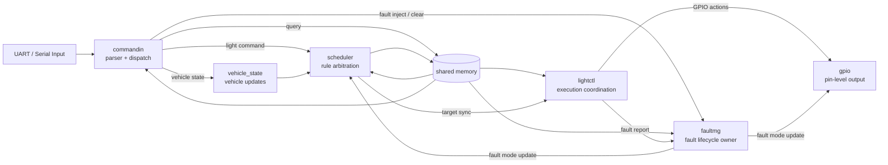
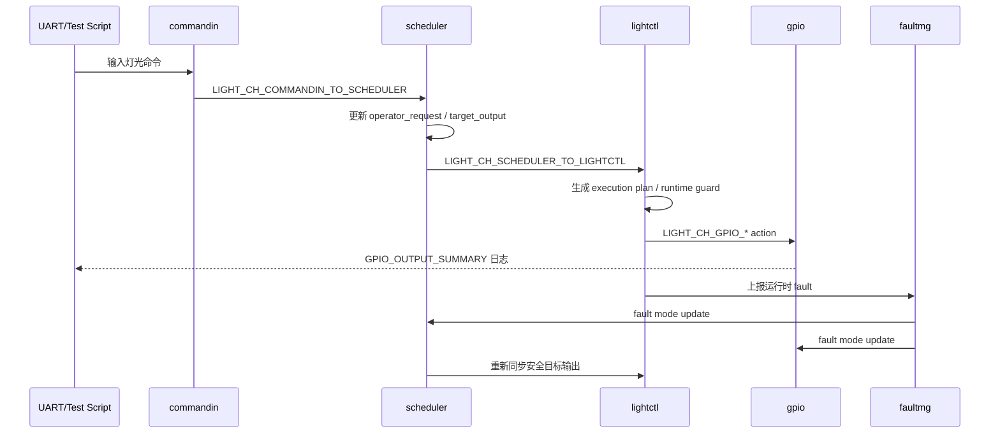
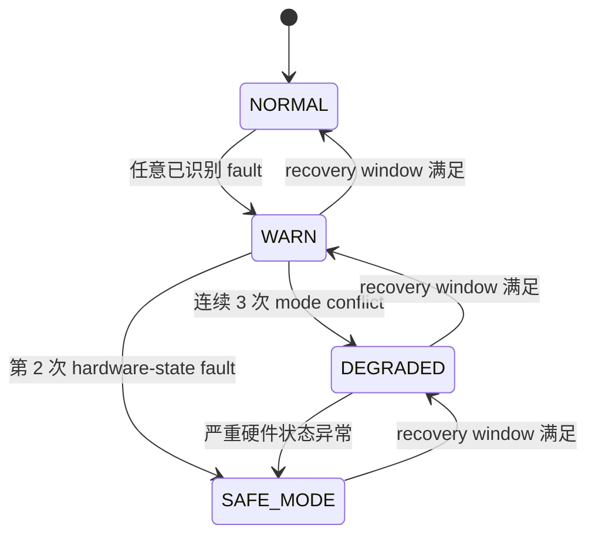
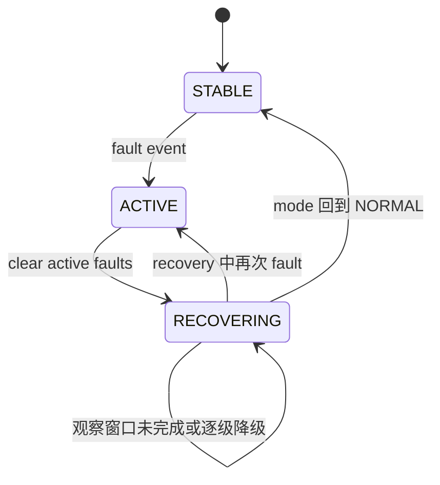

# 概要设计说明书

**项目名称：** 基于 seL4 + Microkit 的汽车车灯控制演示系统  
**文档类型：** 概要设计  
**运行平台：** Ubuntu 22.04 + Microkit SDK 2.0.1 + QEMU `qemu_virt_aarch64`  
**文档版本：** v2.0  

## 版本修订记录

| 版本 | 日期 | 说明 | 作者 |
| --- | --- | --- | --- |
| v1.0 | 2026-05-15 | 初始版本，整理系统概要架构、接口和验证设计。 | 项目组 |
| v2.0 | 2026-06-14 | 同步工程化目录结构、车辆状态模型、真实时间恢复窗口和 final-v2.0 验证结果。 | 项目组 |

## 目录

1. 引言  
2. 总体设计  
3. 系统架构  
4. 模块划分  
5. 接口设计  
6. 数据设计  
7. 故障管理概要  
8. 测试与验证设计  
9. 未解决问题  
10. 小结  

## 1. 引言

### 1.1 编写目的

本文档从系统总体角度描述 LightDemo 的架构设计，包括模块划分、模块关系、通信方式、共享数据和测试设计。概要设计关注“系统由哪些部分组成，各部分如何协作”，为详细设计和代码维护提供依据。

### 1.2 背景

LightDemo 是一个基于 seL4 + Microkit 的汽车车灯控制演示系统。系统运行在 QEMU AArch64 虚拟平台上，模拟车灯控制链路中的输入、调度、执行、GPIO 输出和故障管理过程。

与普通单进程 demo 不同，本项目使用 Microkit protection domain 进行隔离，将职责拆分为多个可独立理解和验证的组件。

### 1.3 设计原则

- **职责单一：** 每个 protection domain 只负责有限职责。
- **通信显式：** channel ID 集中管理，通信路径可追踪。
- **状态集中：** shared memory layout 明确版本。
- **故障唯一 owner：** faultmg 统一管理 fault mode 和 lifecycle。
- **业务逻辑可测：** `src/core/` 中的协议、策略、车辆状态和故障逻辑可在 host-side 单元测试中验证。
- **测试闭环：** host-side 与 QEMU 端到端测试共同覆盖。

## 2. 总体设计

### 2.1 系统目标

系统需要完成从串口输入到车灯输出的完整链路，并在异常情况下进入安全降级状态。核心路径如下：

```text
commandin -> scheduler -> lightctl -> gpio
```

辅助路径包括：

```text
commandin -> vehicle_state -> scheduler
lightctl  -> faultmg
commandin -> faultmg
faultmg   -> scheduler -> lightctl
faultmg   -> gpio
```

### 2.2 运行环境

| 项目 | 说明 |
| --- | --- |
| 操作系统 | Ubuntu 22.04 |
| SDK | Microkit SDK 2.0.1 |
| Board | `qemu_virt_aarch64` |
| Config | `debug` |
| 交叉编译器 | `aarch64-linux-gnu-gcc` 等 |
| 模拟器 | `qemu-system-aarch64` |
| 构建工具 | Makefile |

### 2.3 顶层架构图



### 2.4 控制链路时序图



该时序图强调两点：正常灯光命令必须经过 scheduler 裁决；fault mode 变化由 faultmg 发布后，经 scheduler 重新裁决再影响 lightctl 输出。

## 3. 系统架构

### 3.1 Protection Domain 设计

| Protection Domain | 主要职责 |
| --- | --- |
| `commandin` | 接收 UART 输入，解析 transport message，按消息类型派发。 |
| `scheduler` | 综合 operator request、vehicle state、fault mode，生成 target output。 |
| `lightctl` | 根据 target output 生成 GPIO action plan，并执行 runtime guard。 |
| `gpio` | 执行最终 GPIO 输出，观察 fault mode。 |
| `fault_mg` | 记录 fault event，维护 fault lifecycle 和 fault mode。 |
| `vehicle_state` | 接收车辆状态更新，写入 shared memory，并通知 scheduler。 |

### 3.2 构建产物

主构建目标为：

```bash
make build
```

输出：

- `build/loader.img`
- `build/report.txt`
- 各 protection domain 对应的 `.elf`

`build/` 和 `build-test-hooks/` 属于生成物目录，不进入版本库。源码和系统描述文件按 final v2.0 结构组织：

```text
src/domains/   Microkit protection domain 入口
src/core/      可 host-test 的核心业务逻辑
src/support/   printf 等支撑代码
include/       共享头文件和接口契约
systems/       Microkit system 描述文件
tests/         host-side 测试
scripts/       QEMU 与证据归档脚本
reports/       答辩报告和数据图
```

## 4. 模块划分

### 4.1 commandin

`commandin` 是输入网关。它不直接修改控制策略，也不拥有 fault lifecycle。它只负责：

- UART 初始化和中断处理。
- 将串口字符输入解析为 `light_transport_message_t`。
- 将 light command 派发给 scheduler。
- 将 vehicle state update 派发给 vehicle_state。
- 将 fault inject / clear 派发给 faultmg。
- 对 `?` 查询输出 `STATUS_SNAPSHOT`。

### 4.2 scheduler

`scheduler` 是规则裁决层。它负责：

- 维护 operator request。
- 读取 vehicle state。
- 读取 fault mode。
- 计算 `target_output`。
- 更新 `allow_flags`。
- 通知 lightctl 同步输出。

### 4.3 lightctl

`lightctl` 是执行协调层。它负责：

- 根据当前执行状态和 target output 生成动作计划。
- 执行动作前检查 runtime guard。
- 对允许的动作通知 gpio。
- 对被拒绝的高风险动作上报 faultmg。

### 4.4 gpio

`gpio` 是硬件输出层。它负责：

- 映射 GPIO MMIO。
- 执行具体灯光开关动作。
- 维护输出状态摘要。
- 接收 fault mode 更新通知。

### 4.5 faultmg

`faultmg` 是故障管理 owner。它负责：

- 接收 lightctl 上报或 commandin 注入的 fault。
- 维护 fault counters。
- 执行 fault mode escalation。
- 执行 clear 和 elapsed-time recovery window。
- 发布 fault state 到 shared memory。
- 通知 scheduler 和 gpio。

### 4.6 vehicle_state

`vehicle_state` 负责车辆状态输入：

- speed
- ignition
- brake pedal
- gear
- ambient light
- hazard
- drive mode

状态变化后通知 scheduler 重新裁决。

## 5. 接口设计

### 5.1 Microkit Channel

所有 channel endpoint ID 集中在：

```text
include/light_channels.h
```

并与 `systems/light.system` 保持一致。

| 通信路径 | Channel ID |
| --- | --- |
| commandin -> scheduler | 3 / 4 |
| lightctl -> faultmg | 6 / 5 |
| faultmg -> gpio | 7 / 8 |
| scheduler -> lightctl | 9 / 10 |
| commandin -> faultmg | 11 / 12 |
| faultmg -> scheduler | 14 / 13 |
| vehicle_state -> scheduler | 16 / 15 |
| commandin -> vehicle_state | 17 / 18 |
| lightctl -> gpio actions | 20 - 31 |

### 5.2 Transport Message

输入消息统一为 `light_transport_message_t`，支持：

- light command
- vehicle state update
- fault inject
- fault clear
- query

### 5.3 Shared Memory

核心共享结构为 `light_shmem_t`，布局版本为：

```c
#define LIGHT_SHARED_STATE_LAYOUT_V4 4U
```

主要字段：

- `layout_version`
- `uart_cmd`
- `allow_flags`
- `fault_mode`
- `fault_lifecycle`
- `fault_recovery_ticks`
- `fault_recovery_elapsed_ms`
- `fault_recovery_window_ms`
- `active_fault_mask`
- `operator_request`
- `vehicle_state`
- `target_output`

## 6. 数据设计

### 6.1 Operator Request

表示用户请求的灯光状态：

- low beam
- high beam
- left turn
- right turn
- position
- brake

### 6.2 Vehicle State

表示车辆状态：

- speed kph
- brake pedal
- ignition on
- gear
- ambient light
- hazard
- drive mode

### 6.3 Target Output

表示经过 scheduler 和 fault policy 裁决后的实际目标输出。

### 6.4 Fault State

faultmg 内部维护：

- mode
- lifecycle
- total counters
- active counters
- active fault mask
- recovery ticks
- recovery elapsed/window milliseconds
- last fault code

## 7. 故障管理概要

故障等级：

```text
NORMAL -> WARN -> DEGRADED -> SAFE_MODE
```

生命周期：

```text
STABLE -> ACTIVE -> RECOVERING -> STABLE
```

关键设计点：

- `faultmg` 是 fault mode 唯一 owner。
- clear 不会直接恢复到 NORMAL。
- recovery 满足观察窗口后逐级下降。
- recovery 期间出现新 fault 会打断恢复。

### 7.1 Fault Mode 状态机



### 7.2 Fault Lifecycle 状态机



## 8. 测试与验证设计

### 8.1 Host-side 测试

聚合命令：

```bash
make test
```

覆盖：

- policy
- protocol
- command codec
- transport
- snapshot
- control logic
- vehicle state
- execution plan
- runtime guard
- fault lifecycle

### 8.2 QEMU 测试

聚合命令：

```bash
make qemu-test
```

包含：

- smoke test
- fault injection test
- serial E2E test

## 9. 当前边界

- final v2.0 已使用 elapsed-time recovery window，串口 `C` 保留演示兼容路径。
- fault taxonomy 已补齐来源、等级、恢复策略和测试证据，但阈值仍是课程项目策略，不代表车规认证参数。
- 真实硬件 GPIO 电气行为未作为本次必过项，后续验证方法见 `../docs/real_board_validation_template.md`。
- 文档中的封面信息需要最终按小组信息补齐。

## 10. 小结

LightDemo 的概要设计以 Microkit protection domain 为核心，通过集中 channel 契约、shared memory layout v4、车辆状态模型和 fault lifecycle 将控制链路组织成可解释的工程结构。系统既能演示正常车灯控制，也能演示 fault escalation、safe mode、elapsed-time recovery 和 final-v2.0 数据化验证，是一个适合工程实践展示的嵌入式系统样例。
