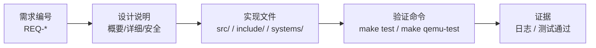
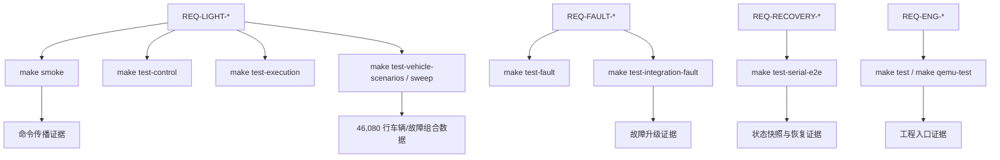

# 需求-设计-实现-测试追踪矩阵

**项目名称：** 基于 seL4 + Microkit 的汽车车灯控制演示系统  
**文档类型：** 工程追踪矩阵  
**文档版本：** v2.0  

## 版本修订记录

| 版本 | 日期 | 说明 | 作者 |
| --- | --- | --- | --- |
| v1.0 | 2026-05-15 | 初始版本，建立需求、设计、实现和测试之间的追踪关系。 | 项目组 |
| v2.0 | 2026-06-14 | 同步 final-v2.0 目录结构、车辆状态模型、恢复窗口和证据归档追踪项。 | 项目组 |

## 1. 编写目的

本文档用于展示 LightDemo 项目的工程闭环。每条关键需求都应能够追踪到设计方案、实现位置和验证命令，从而证明项目不是单纯堆功能，而是具备需求分析、架构设计、详细实现和测试验证之间的对应关系。

## 2. 追踪关系总览



## 3. 功能需求追踪矩阵

| 需求编号 | 需求说明 | 设计依据 | 实现位置 | 验证命令 / 证据 |
| --- | --- | --- | --- | --- |
| REQ-LIGHT-001 | 近光灯命令可从 UART 传播到 GPIO 输出。 | 主控制链路 `commandin -> scheduler -> lightctl -> gpio`。 | `src/domains/commandin.c`, `src/domains/scheduler.c`, `src/domains/lightctl.c`, `src/domains/gpio.c` | `make smoke`; 日志 `CMD_MSG cmd=0x01`, `GPIO_OUTPUT_SUMMARY low=1` |
| REQ-LIGHT-002 | 远光灯受低速、档位、近光和 fault mode 约束。 | scheduler 计算目标输出，lightctl runtime guard 二次保护。 | `src/core/light_control_logic.c`, `src/core/light_runtime_guard.c` | `make test-control`, `make test-runtime`, `make smoke` |
| REQ-LIGHT-003 | 左右转向灯请求互斥。 | operator request 更新时清除相反方向请求。 | `src/core/light_control_logic.c` | `make test-control` |
| REQ-LIGHT-004 | 车辆状态参与目标输出裁决。 | vehicle_state 写 shared memory，scheduler 重新裁决。 | `src/domains/vehicle_state.c`, `src/core/light_vehicle_state.c`, `src/domains/scheduler.c` | `make test-vehicle`, `make test-vehicle-scenarios`, `make test-vehicle-sweep` |
| REQ-LIGHT-005 | 状态查询输出 fault、vehicle、target 和统计信息。 | commandin 读取 shared memory 并输出 `STATUS_SNAPSHOT`，包含 `last_fault_name`、layout 和 contract 状态。 | `src/domains/commandin.c`, `src/core/light_status_snapshot.c` | `make test-snapshot`, `make test-serial-e2e` |
| REQ-LIGHT-006 | final v2.0 应覆盖复杂车辆状态模型。 | 速度、点火、制动、档位、环境光、危险警示、运行模式共同参与裁决。 | `include/light_vehicle_state.h`, `src/core/light_vehicle_state.c`, `src/core/light_control_logic.c` | `make test-vehicle-scenarios`, `make test-vehicle-sweep`; `vehicle-sweep.csv` 46,080 rows |

## 4. 故障与安全需求追踪矩阵

| 需求编号 | 需求说明 | 设计依据 | 实现位置 | 验证命令 / 证据 |
| --- | --- | --- | --- | --- |
| REQ-FAULT-001 | 任意已识别故障进入 `ACTIVE`，并至少进入 `WARN`。 | faultmg 是 fault lifecycle owner。 | `src/domains/faultmg.c`, `src/core/light_fault_mode.c` | `make test-fault`; `FAULTMG_MODE_TRANSITION prev=NORMAL next=WARN` |
| REQ-FAULT-002 | 连续三次 mode conflict 进入 `DEGRADED`。 | active counters 记录连续模式冲突。 | `src/core/light_fault_mode.c` | `make test-fault`, `make test-integration-fault` |
| REQ-FAULT-003 | 两次 hardware state error 进入 `SAFE_MODE`。 | hardware fault counter 达阈值后升级。 | `src/core/light_fault_mode.c`, `src/domains/faultmg.c` | `make test-fault`, `make test-serial-e2e` |
| REQ-FAULT-004 | `DEGRADED` 禁用远光灯并保证最低照明。 | output policy matrix。 | `src/core/light_output_policy.c` | `make test-fault`, `make test-integration-fault` |
| REQ-FAULT-005 | `SAFE_MODE` 强制保守输出。 | safe mode policy：低风险灯打开，高风险灯关闭。 | `src/core/light_output_policy.c`, `src/core/light_runtime_guard.c` | `make test-fault`, `make test-integration-fault` |
| REQ-FAULT-006 | fault taxonomy 应记录来源、等级、触发条件、恢复策略和输出策略。 | fault 分类表和 safety case 同步维护。 | `include/light_fault_mode.h`, `src/core/light_fault_mode.c`, `docs/safety_case.md` | `make test-fault`, `reports/final_v2_metrics.md` |
| REQ-RECOVERY-001 | clear 后不得立即回到 `NORMAL`。 | clear 后进入 `RECOVERING`。 | `src/core/light_fault_mode.c`, `src/domains/faultmg.c` | `make test-fault`, `make test-serial-e2e` |
| REQ-RECOVERY-002 | 恢复应按真实时间窗口逐级下降。 | `light_fault_mode_observe_recovery_at(state, now_ms)` 到窗口后只 step down 一级。 | `src/core/light_fault_mode.c` | `make test-fault`, `make test-serial-e2e`; 日志 `recovery_elapsed_ms=... recovery_window_ms=...` |
| REQ-RECOVERY-003 | 恢复期间新 fault 打断恢复。 | record error 重置 elapsed recovery window 并返回 `ACTIVE`。 | `src/core/light_fault_mode.c` | `make test-fault` |
| REQ-FAULT-DIAG-001 | fault lifecycle 应保留最近事件诊断证据。 | 固定容量 `light_fault_history_t` 记录 event、code、mode、lifecycle、active mask 和 total count。 | `src/core/light_fault_mode.c`, `src/domains/faultmg.c` | `make test-fault`, `FAULTMG_HISTORY` |

## 5. 工程需求追踪矩阵

| 需求编号 | 需求说明 | 设计依据 | 实现位置 | 验证命令 / 证据 |
| --- | --- | --- | --- | --- |
| REQ-ENG-001 | Microkit channel ID 集中管理。 | 所有 C 代码使用 `include/light_channels.h`。 | `include/light_channels.h`, `systems/light.system` | 静态 grep：组件内无本地 channel ID 定义 |
| REQ-ENG-002 | host-side 单测一键运行。 | Makefile 聚合目标。 | `Makefile` | `make test` |
| REQ-ENG-003 | QEMU 验证一键运行。 | Makefile 聚合目标。 | `Makefile`, `scripts/*.sh` | `make qemu-test` 已通过 |
| REQ-ENG-004 | 工程检查文档完整。 | 需求、概要、详细、用户手册、追踪矩阵、数据图说明。 | `project-docs/`, `docs/`, `reports/` | 人工审阅文档结构和内容 |
| REQ-ENG-005 | 验证证据应可归档和复查。 | `make evidence` 生成 `manifest.txt`、`summary.md`，记录 run id、环境和关键证据匹配项。 | `Makefile`, `scripts/collect_evidence.sh`, `test-results/<run-id>/manifest.txt` | `make evidence TEST_RUN_ID=final-v2.0` |
| REQ-ENG-006 | 契约拒绝应使用统一日志格式。 | 各组件输出 `*_CONTRACT_REJECT reason=...`。 | `src/domains/commandin.c`, `src/domains/scheduler.c`, `src/domains/vehicle_state.c`, `src/domains/faultmg.c`, `src/domains/lightctl.c` | QEMU 日志检查 |
| REQ-ENG-007 | 答辩报告应可一键生成。 | `make defense-report` 输出终端友好报告，并提取关键 token。 | `Makefile`, `scripts/defense_report.sh`, `reports/defense_report_final-v2.0.md` | `make defense-report TEST_RUN_ID=final-v2.0` |
| REQ-ENG-008 | 数据结果应可视化说明。 | 论文风格 SVG 图和解释文档展示验证覆盖、sweep 规模、故障恢复和输出分布。 | `reports/final_v2_metrics.md`, `reports/assets/*.svg`, `project-docs/13.final-v2.0数据图说明.md` | 人工审阅图表和数据来源 |

## 6. 测试闭环图



## 7. 当前验证结论

项目当前已在 Ubuntu 22.04 虚拟机中通过：

```bash
make test TEST_RUN_ID=final-v2.0
make build MICROKIT_SDK=../microkit-sdk-2.0.1
make qemu-test TEST_RUN_ID=final-v2.0 MICROKIT_SDK=../microkit-sdk-2.0.1
make evidence TEST_RUN_ID=final-v2.0
make defense-report TEST_RUN_ID=final-v2.0
```

其中 `make qemu-test` 包含：

- `make smoke`
- `make test-integration-fault`
- `make test-serial-e2e`

三项 QEMU 测试均通过，host-side 测试包含车辆场景和 fault recovery，`vehicle-sweep.csv` 覆盖 46,080 行组合数据，说明 Microkit 系统启动、正常命令传播、fault injection、serial snapshot、elapsed-time recovery 和车辆状态裁决均已形成自动化验证闭环。

## 8. 后续可补充的追踪项

- 增加真实板卡 GPIO 验证后，补充硬件验收项。
- 接入真实车辆总线或真实时间源后，补充外设接口追踪项。
- 如果进入更高安全等级评估，需要补充形式化需求、故障树和认证级测试证据。
