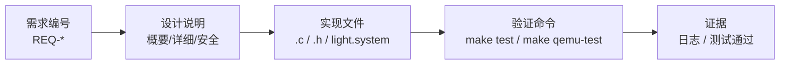
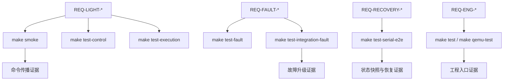

# 需求-设计-实现-测试追踪矩阵

**项目名称：** 基于 seL4 + Microkit 的汽车车灯控制演示系统  
**文档类型：** 工程追踪矩阵  
**文档版本：** v1.0  

## 版本修订记录

| 版本 | 日期 | 说明 | 作者 |
| --- | --- | --- | --- |
| v1.0 | 2026-05-15 | 初始版本，建立需求、设计、实现和测试之间的追踪关系。 | 项目组 |

## 1. 编写目的

本文档用于展示 LightDemo 项目的工程闭环。每条关键需求都应能够追踪到设计方案、实现位置和验证命令，从而证明项目不是单纯堆功能，而是具备需求分析、架构设计、详细实现和测试验证之间的对应关系。

## 2. 追踪关系总览



## 3. 功能需求追踪矩阵

| 需求编号 | 需求说明 | 设计依据 | 实现位置 | 验证命令 / 证据 |
| --- | --- | --- | --- | --- |
| REQ-LIGHT-001 | 近光灯命令可从 UART 传播到 GPIO 输出。 | 主控制链路 `commandin -> scheduler -> lightctl -> gpio`。 | `commandin.c`, `scheduler.c`, `lightctl.c`, `gpio.c` | `make smoke`; 日志 `CMD_MSG cmd=0x01`, `GPIO_OUTPUT_SUMMARY low=1` |
| REQ-LIGHT-002 | 远光灯受低速和近光灯状态约束。 | scheduler 计算目标输出，lightctl runtime guard 二次保护。 | `light_control_logic.c`, `light_runtime_guard.c` | `make test-control`, `make test-runtime`, `make smoke` |
| REQ-LIGHT-003 | 左右转向灯请求互斥。 | operator request 更新时清除相反方向请求。 | `light_control_logic.c` | `make test-control` |
| REQ-LIGHT-004 | 车辆状态参与目标输出裁决。 | vehicle_state 写 shared memory，scheduler 重新裁决。 | `vehicle_state.c`, `light_vehicle_state.c`, `scheduler.c` | `make test-vehicle`, `make test-control` |
| REQ-LIGHT-005 | 状态查询输出 fault、vehicle、target 和统计信息。 | commandin 读取 shared memory 并输出 `STATUS_SNAPSHOT`，包含 `last_fault_name`、layout 和 contract 状态。 | `commandin.c`, `light_status_snapshot.c` | `make test-snapshot`, `make test-serial-e2e` |

## 4. 故障与安全需求追踪矩阵

| 需求编号 | 需求说明 | 设计依据 | 实现位置 | 验证命令 / 证据 |
| --- | --- | --- | --- | --- |
| REQ-FAULT-001 | 任意已识别故障进入 `ACTIVE`，并至少进入 `WARN`。 | faultmg 是 fault lifecycle owner。 | `faultmg.c`, `light_fault_mode.c` | `make test-fault`; `FAULTMG_MODE_TRANSITION prev=NORMAL next=WARN` |
| REQ-FAULT-002 | 连续三次 mode conflict 进入 `DEGRADED`。 | active counters 记录连续模式冲突。 | `light_fault_mode.c` | `make test-fault`, `make test-integration-fault` |
| REQ-FAULT-003 | 两次 hardware state error 进入 `SAFE_MODE`。 | hardware fault counter 达阈值后升级。 | `light_fault_mode.c`, `faultmg.c` | `make test-fault`, `make test-serial-e2e` |
| REQ-FAULT-004 | `DEGRADED` 禁用远光灯并保证最低照明。 | output policy matrix。 | `light_output_policy.c` | `make test-fault`, `make test-integration-fault` |
| REQ-FAULT-005 | `SAFE_MODE` 强制保守输出。 | safe mode policy：低风险灯打开，高风险灯关闭。 | `light_output_policy.c`, `light_runtime_guard.c` | `make test-fault`, `make test-integration-fault` |
| REQ-RECOVERY-001 | clear 后不得立即回到 `NORMAL`。 | clear 后进入 `RECOVERING`。 | `light_fault_mode.c`, `faultmg.c` | `make test-fault`, `make test-serial-e2e` |
| REQ-RECOVERY-002 | 恢复应按观察窗口逐级下降。 | recovery tick 满足后只 step down 一级。 | `light_fault_mode.c` | `make test-fault`, `make test-serial-e2e` |
| REQ-RECOVERY-003 | 恢复期间新 fault 打断恢复。 | record error 重置 recovery ticks 并返回 `ACTIVE`。 | `light_fault_mode.c` | `make test-fault` |
| REQ-FAULT-DIAG-001 | fault lifecycle 应保留最近事件诊断证据。 | 固定容量 `light_fault_history_t` 记录 event、code、mode、lifecycle、active mask 和 total count。 | `light_fault_mode.c`, `faultmg.c` | `make test-fault`, `FAULTMG_HISTORY` |

## 5. 工程需求追踪矩阵

| 需求编号 | 需求说明 | 设计依据 | 实现位置 | 验证命令 / 证据 |
| --- | --- | --- | --- | --- |
| REQ-ENG-001 | Microkit channel ID 集中管理。 | 所有 C 代码使用 `include/light_channels.h`。 | `include/light_channels.h`, `light.system` | 静态 grep：组件内无本地 channel ID 定义 |
| REQ-ENG-002 | host-side 单测一键运行。 | Makefile 聚合目标。 | `Makefile` | `make test` |
| REQ-ENG-003 | QEMU 验证一键运行。 | Makefile 聚合目标。 | `Makefile`, `scripts/*.sh` | `make qemu-test` 已通过 |
| REQ-ENG-004 | 工程检查文档完整。 | 需求、概要、详细、用户手册、追踪矩阵。 | `项目汇报文档/`, `docs/` | 人工审阅文档结构和内容 |
| REQ-ENG-005 | 验证证据应可归档和复查。 | `make evidence` 生成 `manifest.txt`，记录 run id、环境和关键证据匹配项。 | `Makefile`, `test-results/<run-id>/manifest.txt` | `make evidence TEST_RUN_ID=report-v6` |
| REQ-ENG-006 | 契约拒绝应使用统一日志格式。 | 各组件输出 `*_CONTRACT_REJECT reason=...`。 | `commandin.c`, `scheduler.c`, `vehicle_state.c`, `faultmg.c`, `lightctl.c` | QEMU 日志检查 |

## 6. 测试闭环图



## 7. 当前验证结论

项目当前已在 Ubuntu 22.04 虚拟机中通过：

```bash
make build
make qemu-test
```

其中 `make qemu-test` 包含：

- `make smoke`
- `make test-integration-fault`
- `make test-serial-e2e`

三项均通过，说明 Microkit 系统启动、正常命令传播、fault injection、serial snapshot 和 recovery 流程均已形成自动化验证闭环。

## 8. 后续可补充的追踪项

- 增加真实时间 recovery window 后，补充对应需求和测试。
- 增加真实板卡 GPIO 验证后，补充硬件验收项。
- 扩展 fault taxonomy 后，补充每类 fault 的需求和验证脚本。
