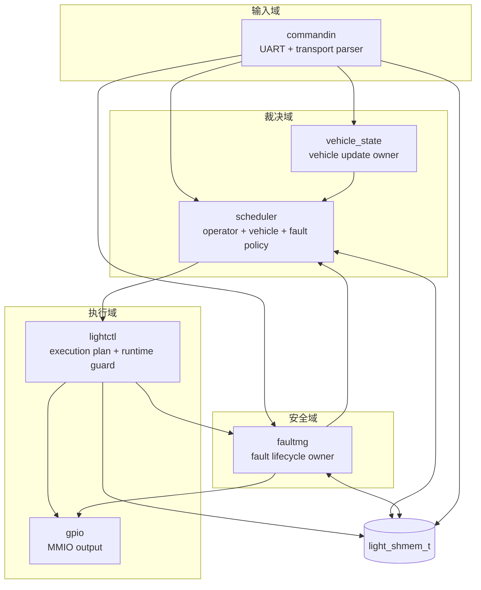
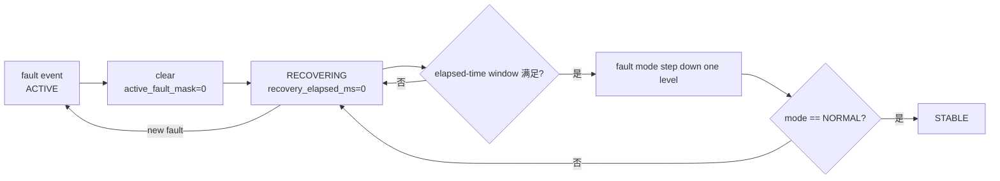
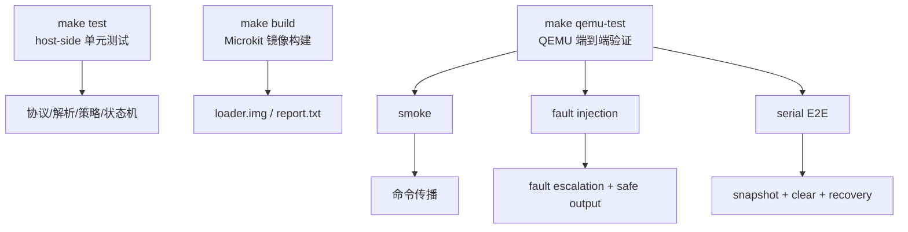

# 详细设计说明书

**项目名称：** 基于 seL4 + Microkit 的汽车车灯控制演示系统  
**文档类型：** 详细设计说明书  
**文档版本：** v2.0  

## 版本修订记录

| 版本 | 日期 | 说明 | 作者 |
| --- | --- | --- | --- |
| v1.0 | 2026-05-15 | 初始版本，整理模块详细设计、数据结构和故障生命周期。 | 项目组 |
| v2.0 | 2026-06-14 | 同步 final-v2.0 工程结构、shared memory layout v4、车辆状态模型和 elapsed-time recovery。 | 项目组 |

## 目录

1. 引言  
2. 开发环境  
3. 系统描述  
4. 数据结构设计  
5. 模块详细设计  
6. 故障生命周期详细设计  
7. 测试设计  
8. 限制条件  
9. 小结  

## 1. 引言

### 1.1 编写目的

本文档对 LightDemo 的内部实现进行详细说明，重点描述各模块职责、输入输出、核心数据结构、通信接口、故障管理逻辑和测试方法。本文档适合开发人员、维护人员和检查人员理解系统内部细节。

### 1.2 背景

LightDemo 使用 C 语言实现，基于 seL4 Microkit 运行在 QEMU AArch64 平台。项目从 tutorial 风格示例演进为具有工程结构的嵌入式控制项目。

## 2. 开发环境

| 项目 | 说明 |
| --- | --- |
| 操作系统 | Ubuntu 22.04 |
| SDK | Microkit SDK 2.0.1 |
| Board | `qemu_virt_aarch64` |
| 默认配置 | `debug` |
| 编译器 | `aarch64-linux-gnu-gcc` |
| 模拟器 | `qemu-system-aarch64` |
| 构建工具 | Makefile |
| 测试脚本 | Bash |

## 3. 系统描述

系统由 6 个主要 protection domain 组成：

```text
commandin
scheduler
lightctl
gpio
fault_mg
vehicle_state
```

系统主链路：

```text
UART -> commandin -> scheduler -> lightctl -> gpio
```

故障链路：

```text
lightctl / commandin -> fault_mg -> scheduler / gpio
```

状态查询：

```text
commandin -> shared memory -> UART
```

### 3.1 Protection Domain 通信图

图 3-1 为 protection domain 通信关系图，用于展示各隔离域之间的主要消息流和 shared memory 访问关系。该图属于工程通信图，不作为 UML 部署图或 UML 组件图使用。



### 3.2 模块接口一致性约束

为避免文档、实现和测试之间出现接口漂移，模块级设计遵循以下一致性规则：

| 约束项 | 说明 | 当前依据 |
| --- | --- | --- |
| Channel ID | 所有 protection domain 通信端点由 `include/light_channels.h` 集中定义，系统描述由 `systems/light.system` 对齐。 | `light_channels.h`, `light.system` |
| Transport message | 跨域消息统一使用 `light_transport_message_t` 表达类型、命令和载荷。 | `include/light_transport.h` |
| Shared memory layout | 运行期状态统一写入 `light_shmem_t`，layout 版本保持可观测。 | `include/light_protocol.h` |
| Fault ownership | fault mode、fault lifecycle、history 由 `faultmg` 统一维护，其它模块只报告或消费结果。 | `src/domains/faultmg.c` |
| Runtime guard | `lightctl` 在执行前再次检查高风险动作，避免调度外的错误输出。 | `src/core/light_runtime_guard.c` |

后续修改模块接口时，应同步更新概要设计、详细设计、追踪矩阵和测试计划。

## 4. 数据结构设计

### 4.1 light_transport_message_t

`light_transport_message_t` 是串口输入解析后的统一消息结构。

字段包括：

- `version`
- `type`
- `len`
- `flags`
- `payload`

支持的消息类型：

| 类型 | 含义 |
| --- | --- |
| `LIGHT_TRANSPORT_MSG_LIGHT_CMD` | 灯光控制命令 |
| `LIGHT_TRANSPORT_MSG_VEHICLE_STATE_UPDATE` | 车辆状态更新 |
| `LIGHT_TRANSPORT_MSG_FAULT_INJECT` | 故障注入 |
| `LIGHT_TRANSPORT_MSG_QUERY` | 状态查询 |
| `LIGHT_TRANSPORT_MSG_FAULT_CLEAR` | 故障清除 |

### 4.2 light_shmem_t

`light_shmem_t` 是主共享内存结构，位于 `include/light_protocol.h`。

主要字段：

| 字段 | 说明 |
| --- | --- |
| `layout_version` | shared memory layout 版本 |
| `uart_cmd` | 最近一次命令 |
| `allow_flags` | target output 的 bitset 表示 |
| `vehicle_speed` | 车辆速度兼容字段 |
| `fault_mode` | 当前 fault mode |
| `fault_lifecycle` | 当前 fault lifecycle |
| `fault_recovery_ticks` | 恢复观察进度 |
| `fault_recovery_elapsed_ms` | 已累计恢复时间 |
| `fault_recovery_window_ms` | 当前恢复窗口阈值 |
| `active_fault_mask` | 当前 active fault 位图 |
| `last_fault_code` | 最近 fault code |
| `total_fault_count` | fault 总计数 |
| `operator_request` | 用户请求 |
| `vehicle_state` | 车辆状态 |
| `target_output` | 目标输出 |

### 4.3 light_fault_state_t

faultmg 内部状态结构，位于 `include/light_fault_mode.h`。

包括：

- `mode`
- `counters`
- `active_counters`
- `lifecycle`
- `active_fault_mask`
- `recovery_ticks`
- `recovery_elapsed_ms`
- `recovery_window_ms`
- `last_fault_code`

### 4.4 light_channels.h

`include/light_channels.h` 集中管理 Microkit channel endpoint ID。该设计避免通道号散落在多个 `.c` 文件中，降低维护风险。

典型定义：

```c
#define LIGHT_CH_COMMANDIN_TO_SCHEDULER       3
#define LIGHT_CH_SCHEDULER_FROM_COMMANDIN     4
#define LIGHT_CH_LIGHTCTL_TO_FAULTMG          6
#define LIGHT_CH_FAULTMG_FROM_LIGHTCTL        5
#define LIGHT_CH_SCHEDULER_TO_LIGHTCTL        9
#define LIGHT_CH_LIGHTCTL_FROM_SCHEDULER      10
```

## 5. 模块详细设计

### 5.1 commandin

#### 5.1.1 程序描述

`src/domains/commandin.c` 是串口输入网关。它接收 UART 中断，读取字符并输入 transport parser。如果解析出完整消息，则根据消息类型派发。

#### 5.1.2 输入项

- UART 字符
- Microkit UART IRQ notification

#### 5.1.3 输出项

- 发送给 scheduler 的 light command
- 发送给 vehicle_state 的 vehicle state update
- 发送给 faultmg 的 fault inject / clear
- 直接输出到 UART 的 `STATUS_SNAPSHOT`

#### 5.1.4 核心流程

```text
notified(UART_IRQ)
  -> uart_get_char()
  -> light_transport_parser_feed_char()
  -> route message
  -> microkit_notify(target)
```

#### 5.1.5 限制条件

commandin 不拥有 fault lifecycle，不直接修改 fault mode。

### 5.2 scheduler

#### 5.2.1 程序描述

`src/domains/scheduler.c` 是规则裁决模块。它消费 light command、vehicle state update 和 fault mode update，调用控制逻辑计算 target output。

#### 5.2.2 输入项

- `LIGHT_CH_SCHEDULER_FROM_COMMANDIN`
- `LIGHT_CH_SCHEDULER_FROM_FAULTMG`
- `LIGHT_CH_SCHEDULER_FROM_VEHICLE_STATE`

#### 5.2.3 输出项

- `target_output`
- `allow_flags`
- 通知 lightctl 同步

#### 5.2.4 核心流程

```text
receive message
  -> update operator_request / read vehicle_state / read fault_mode
  -> light_control_compute_target_output()
  -> update shared memory
  -> notify lightctl
```

### 5.3 lightctl

#### 5.3.1 程序描述

`src/domains/lightctl.c` 是执行协调层。它读取 scheduler 写入的 target output，生成最小 GPIO action plan。

#### 5.3.2 输入项

- scheduler sync notification
- shared memory target output

#### 5.3.3 输出项

- GPIO action notification
- fault report notification

#### 5.3.4 运行时保护

执行动作前调用 `light_runtime_guard_check_action()`：

- SAFE_MODE 下阻止高风险动作。
- DEGRADED 下阻止远光灯。
- 速度不满足时阻止对应灯光行为。
- 状态冲突时上报 fault。

### 5.4 gpio

#### 5.4.1 程序描述

`src/domains/gpio.c` 是硬件输出层，负责实际灯光输出行为和输出摘要。

#### 5.4.2 输入项

- faultmg fault mode update
- lightctl GPIO action notification

#### 5.4.3 输出项

- GPIO 输出状态
- `GPIO_OUTPUT_SUMMARY` 日志

### 5.5 faultmg

#### 5.5.1 程序描述

`src/domains/faultmg.c` 是 fault lifecycle 的唯一 owner。

#### 5.5.2 输入项

- lightctl 上报 fault
- commandin 注入 fault
- commandin clear fault

#### 5.5.3 输出项

- shared memory fault fields
- fault mode compact slot
- scheduler notification
- gpio notification

### 5.6 vehicle_state

#### 5.6.1 程序描述

`src/domains/vehicle_state.c` 负责车辆状态更新。

#### 5.6.2 输入项

- speed
- ignition
- brake pedal
- gear
- ambient light
- hazard
- drive mode

#### 5.6.3 输出项

- shared memory vehicle state
- scheduler update notification

## 6. 故障生命周期详细设计

### 6.1 Fault Taxonomy

| Fault code | 含义 |
| --- | --- |
| `LIGHT_ERR_SPEED_LIMIT` | 速度限制导致动作拒绝 |
| `LIGHT_ERR_MODE_CONFLICT` | 模式冲突 |
| `LIGHT_ERR_INVALID_CMD` | 非法命令或通道 |
| `LIGHT_ERR_HW_STATE_ERR` | 硬件状态异常 |

### 6.2 Fault Mode

| Mode | 行为 |
| --- | --- |
| `NORMAL` | 正常通过 |
| `WARN` | 记录故障但保持输出策略 |
| `DEGRADED` | 禁用远光灯，强制最低照明 |
| `SAFE_MODE` | 强制低风险输出：近光灯和示廓灯打开，高风险输出关闭 |

### 6.3 Lifecycle

| Lifecycle | 含义 |
| --- | --- |
| `STABLE` | 稳定状态 |
| `ACTIVE` | 存在 active fault |
| `RECOVERING` | active fault 已清除，但仍处于观察恢复阶段 |

### 6.4 Escalation

规则如下：

- 任意 fault 进入 `WARN`。
- 连续 3 次 mode conflict 进入 `DEGRADED`。
- 2 次 hardware state error 进入 `SAFE_MODE`。

### 6.5 Recovery

clear 后不直接回 `NORMAL`，而是：

```text
SAFE_MODE -> DEGRADED -> WARN -> NORMAL
```

每次下降一级需要满足恢复观察窗口。



### 6.6 Anti-flap

如果恢复过程中再次发生 fault：

- lifecycle 回到 `ACTIVE`
- recovery elapsed/window 进度清零
- 不允许立即降低 fault severity

## 7. 测试设计

### 7.1 Host-side 测试

命令：

```bash
make test
```

覆盖：

- command codec
- transport parser
- shared protocol
- status snapshot
- vehicle state
- control logic
- execution plan
- runtime guard
- fault lifecycle

### 7.2 QEMU 测试

命令：

```bash
make qemu-test
```

当前已通过：

- `smoke_test.sh`
- `fault_injection_test.sh`
- `serial_e2e_test.sh`

### 7.3 测试证据

典型日志：

```text
CMD_MSG type=light_cmd cmd=0x01
SCHED_TARGET mode=NORMAL ...
LIGHTCTL_TARGET_SUMMARY mode=NORMAL ...
GPIO_OUTPUT_SUMMARY ...
FAULTMG_MODE_TRANSITION prev=WARN next=SAFE_MODE ...
STATUS_SNAPSHOT fault=SAFE_MODE lifecycle=ACTIVE ...
```

### 7.4 测试层次图

图 3-2 为测试层次工程图，用于说明 host-side 测试、构建测试和 QEMU 端到端测试之间的覆盖关系。该图不是 UML 测试模型图。



## 8. 限制条件

- 当前 GPIO 行为在 QEMU 中通过日志观察。
- fault threshold 是项目策略，不是标准法规参数。
- recovery 已采用 elapsed-time window 语义；串口 `C` 仅作为现场演示兼容入口。
- 文档中未包含真实板卡接线图。

## 9. 小结

LightDemo 的详细设计围绕“保护域隔离 + 显式通信 + 安全状态 owner + 自动化验证”展开。项目通过集中 channel 契约、shared memory layout v4、复杂车辆状态模型、fault lifecycle 和 QEMU E2E 测试形成了完整的工程闭环。
