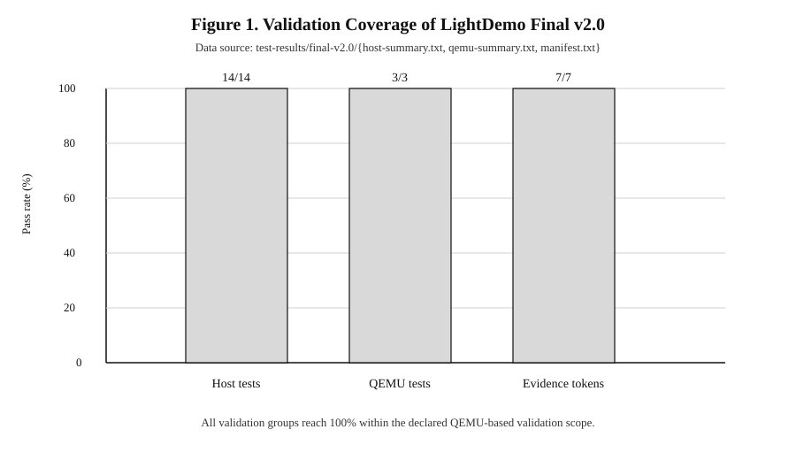
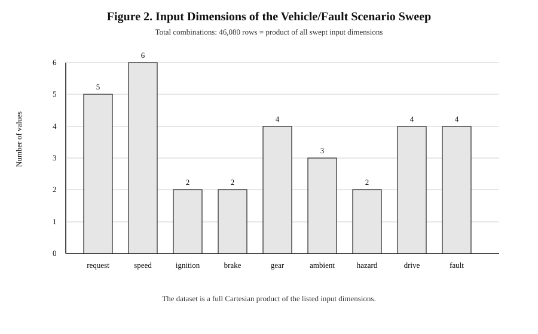
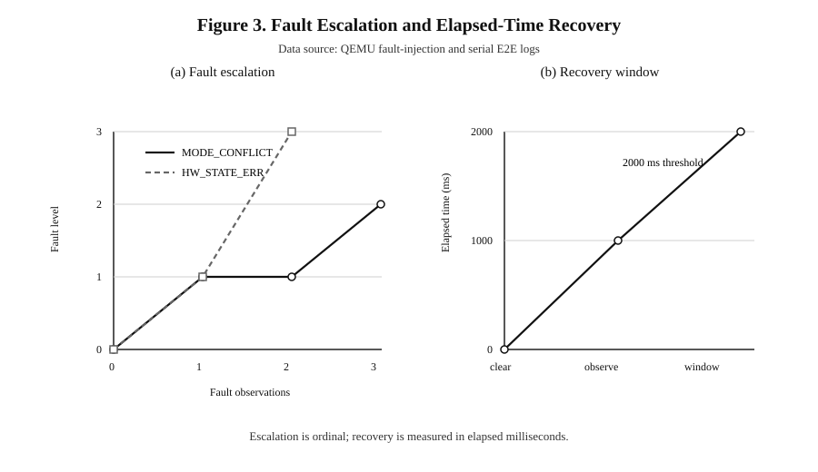
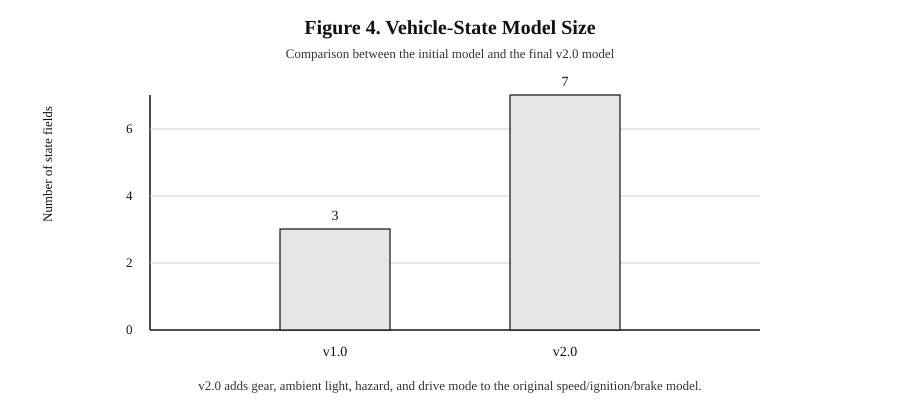
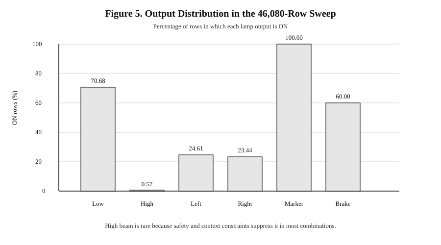

# LightDemo Final v2.0 Experimental Results

This document presents the final validation results in a paper/report style. The figures are derived from the accepted evidence directory `test-results/final-v2.0/`.

## Data Sources

| Evidence file | What it provides |
| --- | --- |
| `test-results/final-v2.0/host-summary.txt` | Host-side test target pass/fail result |
| `test-results/final-v2.0/qemu-summary.txt` | QEMU smoke, fault-integration, and serial E2E result |
| `test-results/final-v2.0/manifest.txt` | Evidence token coverage and run metadata |
| `test-results/final-v2.0/vehicle-sweep.csv` | 46,080-row vehicle/fault scenario sweep |
| `test-results/final-v2.0/serial-e2e/qemu.log` | Runtime evidence for fault escalation, recovery, and status snapshots |

The sweep dataset contains 46,080 data rows plus one header row. Each row is one deterministic combination of operator request, vehicle state, and fault mode.

## Figure 1. Validation Coverage



**Explanation.** Figure 1 summarizes the acceptance evidence at three levels: host-side tests, QEMU tests, and runtime evidence tokens. The y-axis is pass rate, not raw count. All three bars reach 100%, meaning that the project is not validated only by a single manual run. It has unit/scenario tests, system-level QEMU checks, and log-token evidence.

| Group | Passed | Total | Pass rate |
| --- | ---: | ---: | ---: |
| Host-side tests | 14 | 14 | 100% |
| QEMU tests | 3 | 3 | 100% |
| Evidence tokens | 7 | 7 | 100% |

**Conclusion.** The final version has a complete validation closure for the selected QEMU-based scope.

## Figure 2. Scenario Sweep Design



**Explanation.** Figure 2 shows how the 46,080-row dataset is constructed. Each bar is one input dimension, and its height is the number of values swept for that dimension. The total number of rows is the product of all dimensions:

```text
5 request profiles x 6 speed points x 2 ignition states x 2 brake states
x 4 gears x 3 ambient states x 2 hazard states x 4 drive modes x 4 fault modes
= 46,080 rows
```

The sweep is useful because it turns the v2.0 vehicle model into measurable evidence. Instead of only showing several hand-picked examples, it exercises a broad combination space.

| Dimension | Values |
| --- | ---: |
| Request profile | 5 |
| Speed point | 6 |
| Ignition state | 2 |
| Brake pedal state | 2 |
| Gear | 4 |
| Ambient light | 3 |
| Hazard state | 2 |
| Drive mode | 4 |
| Fault mode | 4 |

**Conclusion.** The vehicle-state logic is evaluated over a systematic combinational dataset, which makes the v2.0 result stronger than a small demo sequence.

## Figure 3. Fault Escalation and Recovery



**Explanation.** Figure 3 contains two parts. The left panel shows fault escalation. The y-axis is an ordinal fault level: `NORMAL=0`, `WARN=1`, `DEGRADED=2`, and `SAFE_MODE=3`. The `MODE_CONFLICT` curve reaches `DEGRADED` after repeated conflicts, while the `HW_STATE_ERR` curve reaches `SAFE_MODE` after repeated hardware-state errors. The right panel shows elapsed-time recovery. Recovery is represented by milliseconds, with a 2000 ms window.

| Level | Fault mode |
| ---: | --- |
| 0 | `NORMAL` |
| 1 | `WARN` |
| 2 | `DEGRADED` |
| 3 | `SAFE_MODE` |

Runtime evidence:

```text
FAULTMG_EVENT ... name=HW_STATE_ERR severity=SAFE_MODE_AFTER_2 recovery_policy=clear_then_elapsed_window
FAULTMG_RECOVERY_TICK ... recovery_elapsed_ms=1000 recovery_window_ms=2000
FAULTMG_RECOVERY_TICK prev=SAFE_MODE next=DEGRADED ... recovery_window_ms=2000
```

**Conclusion.** Fault handling is deterministic and explainable: escalation follows the fault taxonomy, and recovery uses elapsed time instead of an abstract observation counter.

## Figure 4. Vehicle Model Size



**Explanation.** Figure 4 compares the number of vehicle-state fields before and after the v2.0 model extension. The original model used three basic fields. The final v2.0 model uses seven fields.

| Version | Fields |
| --- | --- |
| v1.0 | speed, ignition, brake |
| v2.0 | speed, ignition, brake, gear, ambient light, hazard, drive mode |

Runtime evidence:

```text
SCHED_TARGET mode=NORMAL speed=10 ignition=1 brake_pedal=0 gear=3 ambient=0 hazard=0 drive_mode=0
```

**Conclusion.** The v2.0 contribution is not only a UI/logging change. It adds a richer vehicle-state model that directly affects scheduling and target light output.

## Figure 5. Output Distribution in the Sweep

The sweep also provides output-distribution data. These values are computed from `vehicle-sweep.csv`.



| Output | ON rows | Percentage |
| --- | ---: | ---: |
| Low beam | 32,568 | 70.68% |
| High beam | 264 | 0.57% |
| Left turn | 11,340 | 24.61% |
| Right turn | 10,800 | 23.44% |
| Marker | 46,080 | 100.00% |
| Brake | 27,648 | 60.00% |

**Explanation.** High beam has a very low ON percentage because it is constrained by low-beam request, speed, brake state, parking/reverse context, and fault mode. Marker light is always ON in this sweep because the tested combinations include contexts and policies that preserve visibility. Brake output is ON in 60% of rows because it can be activated either by operator request or brake-pedal state.

**Conclusion.** The output distribution supports the safety-oriented behavior: conservative visibility is common, while high beam is rare and heavily constrained.

## Defense Reading Order

1. Use Figure 1 to show that the final version has validation closure.
2. Use Figure 2 to show the amount of systematic data: 46,080 scenario rows.
3. Use Figure 3 to explain fault escalation and elapsed-time recovery.
4. Use Figure 4 to explain the v2.0 vehicle-model expansion.
5. Use Figure 5 to explain how the model affects actual light outputs.
