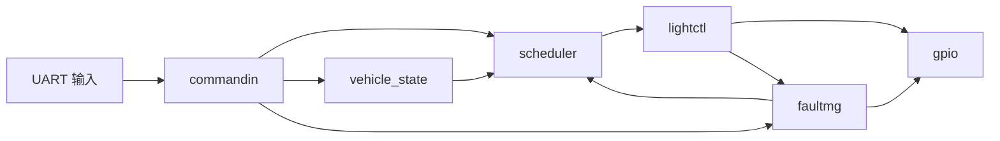

# LightDemo Final v2.0 Showcase

## Data Dashboard

Open `reports/final_v2_metrics.md` when the defense needs a visual result page. It provides:

- validation pass-rate chart: Host 14/14, QEMU 3/3, evidence tokens 7/7
- scenario sweep chart: 46,080 vehicle/fault combinations in CSV evidence
- fault escalation chart: MODE_CONFLICT to DEGRADED, HW_STATE_ERR to SAFE_MODE
- elapsed-time recovery chart: 0 ms -> 1000 ms -> 2000 ms window
- vehicle model growth chart: v1.0 3 fields -> v2.0 7 fields

## 一屏结论

| 维度 | 结论 |
| --- | --- |
| 项目定位 | seL4/Microkit 汽车灯光控制工程样板 |
| 最终版本 | LightDemo Engineering Final v2.0 |
| 验证环境 | Ubuntu 22.04 VM + QEMU |
| Host tests | PASS |
| QEMU tests | PASS |
| Shared layout | layout=4 |
| 证据目录 | `test-results/final-v2.0/` |

## 系统链路



## v1.1-v2.0 工程演进

| 版本 | 目标 | 展示证据 |
| --- | --- | --- |
| v1.1 | elapsed-time recovery window | `recovery_elapsed_ms=... recovery_window_ms=2000` |
| v1.2 | fault taxonomy | `FAULTMG_EVENT ... severity=... recovery_policy=...` |
| v1.3 | 自动证据归档 | `manifest.txt`, `summary.md`, `defense_report.md` |
| v2.0 | 复杂车辆状态模型 | `gear`, `ambient`, `hazard`, `drive_mode` |

## 验证结果

| 命令 | 结果 | 证据 |
| --- | --- | --- |
| `make test TEST_RUN_ID=final-v2.0` | PASS | `host-summary.txt` |
| `make qemu-test TEST_RUN_ID=final-v2.0` | PASS | `qemu-summary.txt` |
| `make evidence TEST_RUN_ID=final-v2.0` | PASS | `manifest.txt` |
| `make defense-report TEST_RUN_ID=final-v2.0` | PASS | `defense_report_final-v2.0.md` |

## 关键日志

```text
STATUS_SNAPSHOT fault=SAFE_MODE lifecycle=ACTIVE recovery_ticks=0/2 recovery_elapsed_ms=0/2000 ... layout=4 contract=OK
STATUS_SNAPSHOT fault=DEGRADED lifecycle=RECOVERING recovery_ticks=0/2 recovery_elapsed_ms=0/2000 ... layout=4 contract=OK
FAULTMG_EVENT source=commandin code=0x04 name=HW_STATE_ERR severity=SAFE_MODE_AFTER_2 recovery_policy=clear_then_elapsed_window
SCHED_TARGET mode=NORMAL speed=10 ignition=1 brake_pedal=0 gear=3 ambient=0 hazard=0 drive_mode=0
```

## 答辩讲解顺序

1. 先展示本页“一屏结论”，说明项目已经从 demo 收口为工程化 v2.0。
2. 展示系统链路图，强调 seL4/Microkit protection domain 分工。
3. 展示 v1.1-v2.0 演进表，说明工作量不是堆功能，而是工程增强。
4. 打开 `test-results/final-v2.0/manifest.txt`，说明证据可追溯。
5. 打开 `test-results/final-v2.0/serial-e2e/qemu.log`，搜索 `STATUS_SNAPSHOT`。
6. 最后说明边界：QEMU 验证完成，真实板卡 GPIO 已提供后续验证模板。
